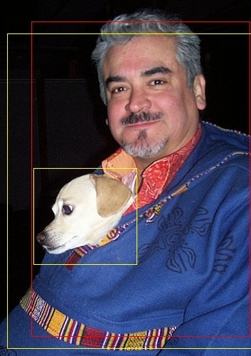

# UG1334 - YOLOv3 Tutorial: Darknet to Caffe to Xilinx DNNDK

## Preparation

```shell-session
$ cat \
../Edge-AI-Platform-Tutorials/docs/Darknet-Caffe-Conversion/yolov3_deploy.tar.gz.partaaa \
../Edge-AI-Platform-Tutorials/docs/Darknet-Caffe-Conversion/yolov3-deploy.tar.gz.partaab \
  > yolov3_deploy.tar.gz
$ tar xf yolov3_deploy.tar.gz
```

## Create YOLO v3 caffe model

- Get YOLO v3 model

```shell-session
$ mkdir _model
$ cp ../Edge-AI-Platform-Tutorials/docs/Darknet-Caffe-Conversion/example_yolov3/0_model_darknet/yolov3.cfg _model/
$ wget https://pjreddie.com/media/files/yolov3.weights -O _model/yolov3.weights
```

- Convert to .caffemodel

```shell-session
$ python yolo_convert.py \
_model/yolov3.cfg  _model/yolov3.weights \
caffe_model/v3.prototxt caffe_model/v3.caffemodel
```

## Quantize

- Create calibration dataset

```shell-session
$ tar xf ../Edge-AI-Platform-Tutorials/docs/Darknet-Caffe-Conversion/example_yolov3/5_file_for_test/calib_data.tar -C .
$ cp ../Edge-AI-Platform-Tutorials/docs/Darknet-Caffe-Conversion/example_yolov3/5_file_for_test/calib.txt calib_data/
```

- Copy .prototxt for calibration

```shell-session
$ cp ../Edge-AI-Platform-Tutorials/docs/Darknet-Caffe-Conversion/example_yolov3/2_model_for_quantize/v3_example.prototxt caffe_model

# Edit .prototxt to suit this environment
$ sed -i s/'PATH_TO\/5_file_for_test\/calib.txt'/'calib_data\/calib.txt'/ caffe_model/v3_example.prototxt
$ sed -i s/'PATH_TO\/5_file_for_test\/'/''/ caffe_model/v3_example.prototxt
```

- Quantization

```shell-session
$ decent-cpu quantize \
-model caffe_model/v3_example.prototxt \
-weights caffe_model/v3.caffemodel \
-output_dir _quant \
-sigmoided_layers layer81-conv,layer93-conv,layer105-conv \
-method 1

WARNING: Logging before InitGoogleLogging() is written to STDERR
I0926 20:13:14.193974  1712 decent.cpp:248] Use CPU.
I0926 20:13:15.363730  1712 net.cpp:98] Initializing net from parameters: 
state {
  phase: TRAIN
}

...

I0926 20:36:53.536026  1712 net.cpp:310] This network produces output label
I0926 20:36:53.536042  1712 net.cpp:310] This network produces output layer105-conv
I0926 20:36:53.536058  1712 net.cpp:310] This network produces output layer81-conv
I0926 20:36:53.536074  1712 net.cpp:310] This network produces output layer93-conv
I0926 20:36:53.536227  1712 net.cpp:330] Network initialization done.
I0926 20:36:53.539894  1712 decent.cpp:354] Start Deploy
I0926 20:36:59.080209  1712 decent.cpp:362] Deploy Done!
--------------------------------------------------
Output Deploy Weights: "_quant/deploy.caffemodel"
Output Deploy Model:   "_quant/deploy.prototxt"
```         

## Deploy

- Modify _\_quant/deploy.prototxt_

```shell-session
$ sed -i '5,9 {s/^/#/}' _quant/deploy.prototxt
```

- Compile the model 

```shell-session
$ dnnc-dpu1.4.0 \
--prototxt=_quant/deploy.prototxt \
--caffemodel=_quant/deploy.caffemodel \
--dcf=<.dcf file for taeget> \
--cpu_arch=arm64 \
--output_dir=_deploy \
--net_name=yolo \
--save_kernel \
--mode=normal

DNNC Kernel topology "yolo_kernel_graph.jpg" for network "yolo"
DNNC kernel list info for network "yolo"
                               Kernel ID : Name
                                       0 : yolo

                             Kernel Name : yolo
--------------------------------------------------------------------------------
                             Kernel Type : DPUKernel
                               Code Size : 2.61MB
                              Param Size : 59.05MB
                           Workload MACs : 140691.89MOPS
                         IO Memory Space : 18.00MB
                              Mean Value : 0, 0, 0, 
                              Node Count : 77
                            Tensor Count : 78
                    Input Node(s)(H*W*C)
                          layer0_conv(0) : 608*608*3
                   Output Node(s)(H*W*C)
                         layer81_conv(0) : 19*19*255
                         layer93_conv(0) : 38*38*255
                        layer105_conv(0) : 76*76*255
```

## Create .elf

```shell-session
# Substitute "dnndk.h" with "n2cube.h" & "dputils.h"
$ sed -ie "s|#include <dnndk/dnndk.h>|#include \"n2cube.h\"\n#include \"dputils.h\"|g" yolov3_deploy/src/main.cc

# Build
$ ${CXX} yolov3_deploy/src/main.cc \
-Iyolov3_deploy/src -I../pkg_mpsoc/include -L../pkg_mpsoc/lib \
-lopencv_core -lopencv_highgui -lopencv_imgproc -lopencv_imgcodecs -lopencv_videoio \
-ln2cube -ldputils -lhineon -lpthread \
_deploy/dpu_yolo.elf -o ug1334.elf
```

## Run

- Copy _ug1334.elf_ & _yolov3\_deploy/coco\_test.jpg_ into SD card

- Run the application

```shell-session
$ ./ug1334.elf coco_test.jpg i
boxes size: 19
0.991876 44.9521 30.4065 351.873 472.416
0.620821 47.038 236.548 192.493 371.538
0.124843 10.3188 47.7135 358.106 489.723
0.180861 10.3188 47.7135 358.106 489.723
```


